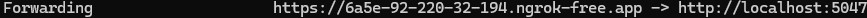
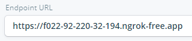
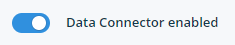
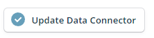

# Disruptive Workshop

Welcome to the Disruptive workshop! This repo contains examples and documentation to be used in the workshop.
Disruptive has written an extensive amount of documentation located [here](https://disruptive.gitbook.io/docs).

# 0.0 - Setting up the API

The API is written in C# with .NET 8. Therefore there are a couple of requirements to get it up and running:

- Install the .NET 8 SDK. Find and download (the newest version) [here](https://dotnet.microsoft.com/en-us/download/dotnet/8.0).
- Write `dotnet --info` in a terminal to check that it successfully installed. Might have to restart the terminal first.

In a terminal, navigate to [api]('./SensorSolution/Exercise1/api') in the `Exercise1` directory in this repo and execute `dotnet watch`. The API should now be running on [http://localhost:1337](http://localhost:1337). Swagger should be exposed on [http://localhost:1337/swagger](http://localhost:1337/swagger). Since we ran `dotnet watch` the code should auto recompile on changes, but it's still a bit janky, so you can do `cmd + r` or `ctrl + r` in the terminal to force it to recompile.

Keep the API running and let's continue.

# 0.1 - The API

The API is a [.NET minimal API](https://learn.microsoft.com/en-us/aspnet/core/tutorials/min-web-api?view=aspnetcore-8.0&tabs=visual-studio). Minimal APIs were introduced in .NET 6 and offers a lightweight alternative to the standard controller based API. Instead of controller files, we now simply have endpoints. In this particular API, there is one endpoint which is located in the `SensorEndpoints.cs` file.

This endpoint (let's call it the sensor-endpoint) receives sensor data from Disruptive. It obviously does not do this without som configuration, so let's do that.

# 0.2 - The Disruptive Portal

You should all have been given access to the [Disruptive portal](https://studio.disruptive-technologies.com/). Shout out if you haven't. Log in with your credentials and choose the project with your name. In the `Sensors & Cloud Connectors` page you can see all the devices that are configurable in this project. You should have a sensor named after you. That's neat!

Now, navigate to `API Integrations` and the choose `Data connectors`. Again, here you'll have a connector named after you. Doubly neat!

Simply put; a data connector is a webhook. You need to configure it to forward data from a sensor to an endpoint. We want it to send data to our locally hosted APIs (i.e. our localhost). We can do this with a proxy. That takes us to our next step.

# 0.3 Install ngrok

ngrok is a free proxy service that enables forwarding HTTPS traffic from a publicly accessible URL to a port on localhost. So we can use it to create an online endpoint that'll forward data to our computers. Go to their [download page](https://ngrok.com/download) to find instructions on how to download and install it.

> [!IMPORTANT]
> WithSecure will quarantine ngrok on MacOS from both the official Homebrew cask and the Ngrok Homebrew tap.
> If you encounter any problems running ngrok on MacOS you can exclude Homebrew from the quarantine.
> Go to WithSecure -> Settings -> Malware Protection -> Scanning exclusions and add the ngrok binary.

Sadly, they now require an account to use it. Without an account you wont be able to obtain an access token. So go ahead and create a user account on their website. When you've done this (and installed it) log in an copy the command that contains your token. It should look something like this: `ngrok config add-authtoken <your_token>`

Now your ready to create a proxy. To do so, run: `ngrok http 1337`.

If successful, you'll now have a proxy. It should look like this:

Leave ngrok running and copy the URL. One important note to make: <i> restarting ngrok will produce a different URL. </i> Therefore, try to keep it running throughout the whole workshop.

Now that you have a URL, return to the Disruptive portal and navigate to your data connector. Paste the URL in the `Endpoint URL` textfield. Like this:

Now enable your data connector. It's the switch that looks like this:

Scroll to the bottom of the page and click `Update data connector`

When this is done, return to where your API is still (hopefully) running. Is it printing sweet, sweet data? If yes, celebrations! 🎉 If no, return to start... 😡 Or call out, and I'll come and help you.

If all is well and good, you can now start [Exercise1](./SensorSolution/Exercise1/README.md).
